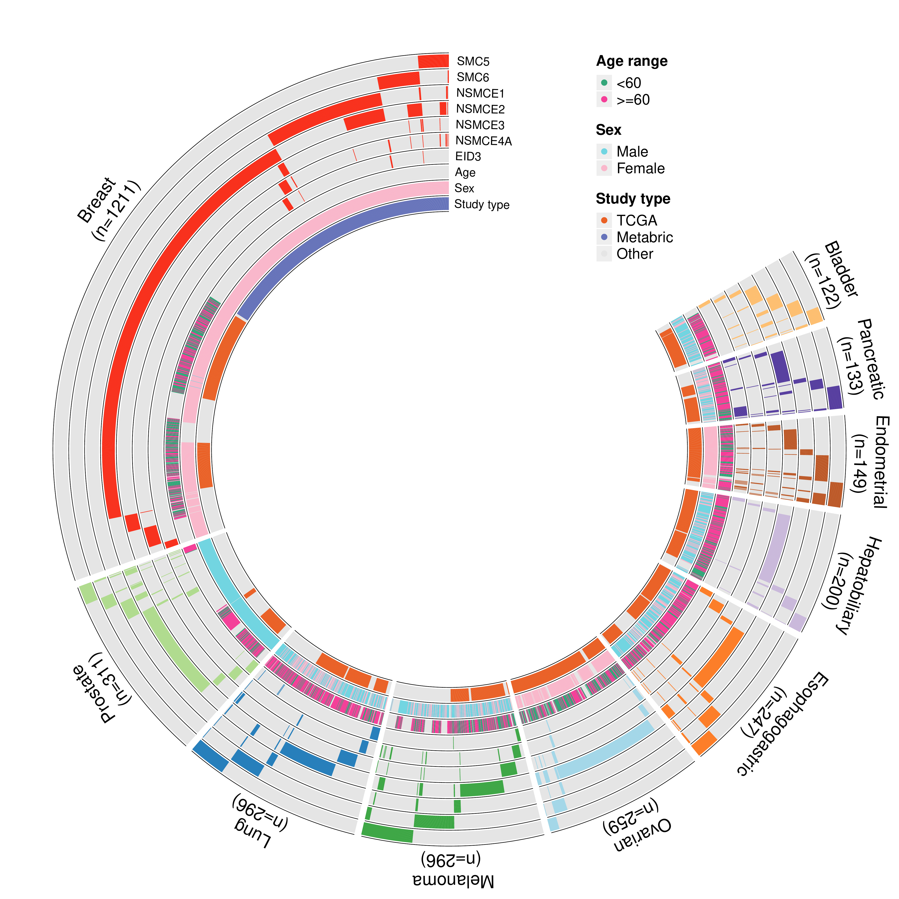

# SMC5-6_complex

This is the code to generate the bioinformatics results present in the manuscript

## Steps to reproduce the results:

1. Download the manuscript associated data files from Zenodo at (https://doi.org/10.5281/zenodo.7618023)[https://doi.org/10.5281/zenodo.7618023]
2. Place the files in the data folder in the data folder of the repository.
3. Runs the scripts in the `./R/` folder from `s01_...` to `s12_...` in order. 
4. Run the script pretaining to the figure you would like.

## Example

To reproduce figure 2, run the `fig2.R` script. Ensure that you are executing the script.
From the root directory of the repository (from the `./SMC5-6_complex` folder).

```
Rscript ./R/fig2.R
```

Results:


